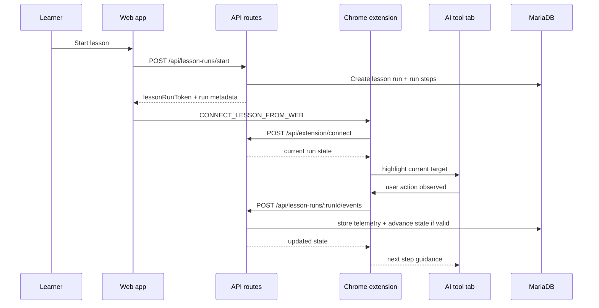

# PromptPilot Technical Notes

## Overview

PromptPilot is a Next.js application that teaches AI product workflows through guided lessons, strict step validation, and a Chrome extension bridge. The current product is Gemini-first, but the runtime supports multiple AI destinations and lesson content files.

## Architecture

### Core services

- **Web app**: Next.js App Router UI and API routes
- **Persistence**: MariaDB accessed through Prisma
- **Extension bridge**: Manifest V3 background worker, bridge script, and content script
- **Lesson engine**: validates ordered step progression, run state, and completion rules

### Top-level flow



## Repository map

- `src/app`: pages and API routes
- `src/lib`: auth, crypto, runtime, Prisma, and HTTP helpers
- `src/components`: reusable UI such as the navbar
- `src/types`: shared lesson contracts
- `data/tools.json`: tool registry
- `data/lessons/*.json`: lesson content files
- `prisma/schema.prisma`: relational model
- `prisma/seed.ts`: tool, lesson, and optional admin bootstrap
- `extension/`: bridge and content scripts
- `tests/`: lesson engine and token tests

## Runtime design

### Lesson runs

Each lesson run is created with one `LessonRunStep` row per lesson step.

- first step starts as `ACTIVE`
- remaining steps start as `LOCKED`
- completion only advances from the current active step
- a completed lesson run awards a unique badge per user and lesson

### Extension messaging

Web app to extension:

```ts
{
  type: "CONNECT_LESSON_FROM_WEB";
  lessonRunToken: string;
}
```

Content script to background:

```ts
{
  type: "STEP_EVENT";
  stepId: string;
  eventType: "ELEMENT_FOUND" | "CLICK" | "INPUT_ACTIVITY" | "RESPONSE_VISIBLE";
  url: string;
  timestamp: string;
  meta?: {
    selectorId?: string;
    inputLengthBucket?: "0" | "1-20" | "21-100" | "100+";
  };
}
```

### Supported selector types

- CSS selectors
- `text=...`
- Gemini-specific `special=...` matchers for resilient targeting

## Data model summary

Main tables:

- `User`
- `Consent`
- `Tool`
- `Lesson`
- `LessonStep`
- `LessonRun`
- `LessonRunStep`
- `TelemetryEvent`
- `BadgeAward`

Important invariants:

- consent is unique per `userId + policyVersion`
- lesson steps are unique per `lessonId + stepOrder`
- badges are unique per `userId + lessonId`
- step telemetry is stored without prompt text or model response text

## Environment variables

| Variable | Notes |
| :-- | :-- |
| `DATABASE_URL` | Required Prisma connection string |
| `AUTH_SECRET` | Required session secret |
| `LESSON_TOKEN_SECRET` | Required extension run-token secret |
| `POLICY_VERSION` | Required consent gate version |
| `NEXT_PUBLIC_APP_URL` | App origin |
| `NEXT_PUBLIC_API_BASE_URL` | Optional override, usually empty |
| `SEED_ADMIN_EMAIL` | Optional admin bootstrap |
| `SEED_ADMIN_PASSWORD` | Optional admin bootstrap, minimum 12 chars |

## Seeding behavior

The seed script:

1. loads `data/tools.json`
2. auto-discovers lesson files in `data/lessons`
3. upserts lessons and lesson steps
4. optionally creates an admin user if `SEED_ADMIN_EMAIL` and `SEED_ADMIN_PASSWORD` are set

No default admin credentials are committed.

## Local setup

### Docker

```bash
cp .env.example .env
docker compose up --build
```

### Local Node.js

```bash
npm install
npx prisma generate
npx prisma db push
npm run seed
npm run dev
```

## Quality gates

- `npm run lint`
- `npm run test`
- `npm run build`

CI is defined in `.github/workflows/ci.yml`.

## Troubleshooting

### Extension does not connect

- confirm the extension is reloaded in `chrome://extensions`
- confirm the app is running on `http://localhost:3000`
- check the extension popup for connection state

### Docker issues

- inspect `docker compose logs web`
- inspect `docker compose logs db`
- confirm your `.env` has valid secrets and DB values

### Database reset

```bash
npx prisma db push
npm run seed
```

## 16. Security Notes
- Replace default secrets before shared usage.
- Keep this MVP internal/local only.
- Move to signed HTTPS origins before production usage.
- Add rate limiting and audit logging for public deployment.

## 17. Current Status
Implemented and verified:
- Dockerized stack boots (`web` + `db`)
- Prisma schema applied and seed executed automatically in container
- Auth, consent, lesson start, and extension connect APIs working
- Lint and tests pass

Remaining for broader release:
- Production deployment hardening
- Multi-tool support beyond Gemini
- Admin lesson editor UI
