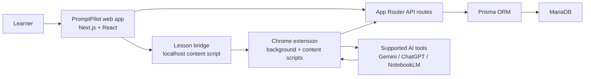

# PromptPilot

PromptPilot is an interactive AI learning platform that teaches real product workflows through guided, verified practice. Instead of static tutorials, learners work inside the actual tool interface while PromptPilot tracks step completion, highlights the next action, and records progress without storing prompt or response text.

[](https://nextjs.org/)
[](https://www.typescriptlang.org/)
[](https://mariadb.org/)
[](https://www.docker.com/)
[](./LICENSE)


## Why PromptPilot exists

Most AI tutorials are still passive. They assume technical confidence, skip the hard parts of using real tools, and leave beginners guessing whether they did the task correctly.

PromptPilot closes that gap with:

- guided step-by-step lessons
- real-time verification via a Chrome extension bridge
- accessibility-first interface decisions for beginners and older learners
- privacy-safe telemetry focused on learning progress, not prompt contents

## Product highlights

- **Interactive lessons**: learners follow steps directly inside Gemini, ChatGPT, or NotebookLM flows
- **Verified progression**: a lesson only advances when the current required step is actually completed
- **Progress and badges**: users can track completions, runs, and earned achievements
- **Admin visibility**: admins can review learners, lessons, and platform stats
- **Warm visual design**: white-and-amber gradients, lift-on-hover cards, slide-up hero motion, and large touch targets
- **Docker-first setup**: web app and MariaDB can be booted with one compose file

## Experience and motion system

PromptPilot is intentionally not styled like a generic dashboard template.

- **Color direction**: warm amber accents on an airy white background
- **Texture**: layered radial gradients give the landing pages depth without adding noise
- **Motion**: hero content uses staged slide-up entry; cards use soft hover elevation to reinforce interactivity
- **Accessibility**: 18px base font sizing, visible focus rings, and 48px minimum target sizing across the UI

## System architecture



### Runtime flow

1. A learner starts a lesson in the web app.
2. The app creates a lesson run and signs a short-lived lesson token.
3. The extension connects that lesson run through the localhost bridge.
4. The content script highlights the active UI target in the real AI tool.
5. Step events are sent back to the app for validation in strict order.
6. Progress, badges, and telemetry-safe run state are stored in MariaDB.

## Tech stack

| Layer | Technology |
| :-- | :-- |
| Frontend | Next.js 14 App Router, React 18, TypeScript |
| Styling | Custom CSS with responsive layout and motion |
| Backend | Next.js API routes |
| Database | MariaDB 11.4 |
| ORM | Prisma |
| Auth | Signed cookie session + lesson run token flow |
| Browser integration | Chrome Extension Manifest V3 |
| Tooling | Docker Compose, ESLint, Vitest |

## Repository structure

```text
promptpilot/
├── src/
│   ├── app/                  # Pages and API routes
│   ├── components/           # Shared UI
│   ├── lib/                  # Auth, runtime, Prisma, crypto helpers
│   └── types/                # Shared contracts
├── data/
│   ├── tools.json            # Tool registry
│   └── lessons/              # Lesson content files
├── extension/                # PromptPilot Coach extension
├── prisma/                   # Schema and seed script
├── public/images/            # README and product images
├── docs/                     # Project and release docs
├── .github/workflows/        # CI automation
├── Dockerfile
└── docker-compose.yml
```

## Supported tools

- Google Gemini
- ChatGPT
- NotebookLM

Current lesson coverage is Gemini-first, with the extension runtime already shaped for multi-tool support.

## Security and privacy posture

- No prompt text is stored
- No model response text is stored
- Telemetry is limited to step-verification metadata such as event type, selector identifier, URL hash, and input length bucket
- Secrets are injected through environment variables
- The seed script does **not** create a default admin account unless you explicitly provide `SEED_ADMIN_EMAIL` and `SEED_ADMIN_PASSWORD`
- The extension manifest is scoped to supported AI hosts plus local PromptPilot development origins

See [`SECURITY.md`](./SECURITY.md) for the reporting policy.

## Quick start with Docker

### Prerequisites

- Docker Desktop
- Git
- Chrome or Chromium for the extension workflow

### 1. Clone and configure

```bash
git clone https://github.com/bishaldan/promptpilot.git
cd promptpilot
cp .env.example .env
```

Set strong values for:

- `AUTH_SECRET`
- `LESSON_TOKEN_SECRET`

Optional admin bootstrap:

```bash
SEED_ADMIN_EMAIL=admin@example.com
SEED_ADMIN_PASSWORD=use-a-long-unique-password
```

### 2. Start the stack

```bash
docker compose up --build
```

The app will be available at [http://localhost:3000](http://localhost:3000).

### 3. Load the extension

1. Open `chrome://extensions`
2. Turn on Developer Mode
3. Click `Load unpacked`
4. Select the `extension/` directory
5. Reload the extension after any source change

## Local development without Docker

```bash
npm install
npx prisma generate
npx prisma db push
npm run seed
npm run dev
```

If you want the seed script to create an admin user:

```bash
SEED_ADMIN_EMAIL=admin@example.com SEED_ADMIN_PASSWORD=use-a-long-unique-password npm run seed
```

## Environment variables

| Variable | Required | Purpose |
| :-- | :-- | :-- |
| `DATABASE_URL` | Yes | Prisma connection string for MariaDB |
| `AUTH_SECRET` | Yes | Session token signing secret |
| `LESSON_TOKEN_SECRET` | Yes | Extension lesson-run token signing secret |
| `POLICY_VERSION` | Yes | Consent version gate |
| `NEXT_PUBLIC_APP_URL` | Yes | Public app URL |
| `NEXT_PUBLIC_API_BASE_URL` | No | Leave empty for same-origin `/api` |
| `SEED_ADMIN_EMAIL` | No | Bootstrap admin email during seeding |
| `SEED_ADMIN_PASSWORD` | No | Bootstrap admin password during seeding |

## Quality checks

Run before pushing or opening a pull request:

```bash
npm run lint
npm run test
npm run build
```

GitHub Actions runs the same quality checks automatically on pushes and pull requests.

## Documentation

- [`DOC.md`](./DOC.md): technical architecture, data flow, and API overview
- [`docs/PROJECT.md`](./docs/PROJECT.md): concise project summary
- [`docs/CHANGELOG.md`](./docs/CHANGELOG.md): release history
- [`CONTRIBUTING.md`](./CONTRIBUTING.md): contribution workflow

## Screenshots

| Landing page | About page |
| :-- | :-- |
|  |  |

## License

PromptPilot is available under the [MIT License](./LICENSE).
